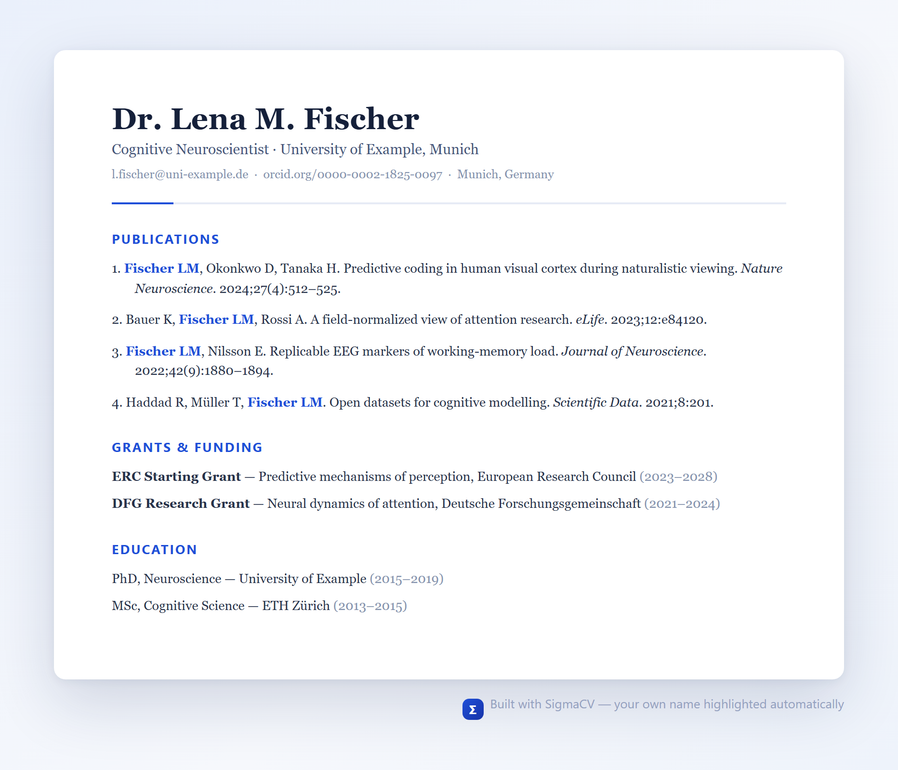
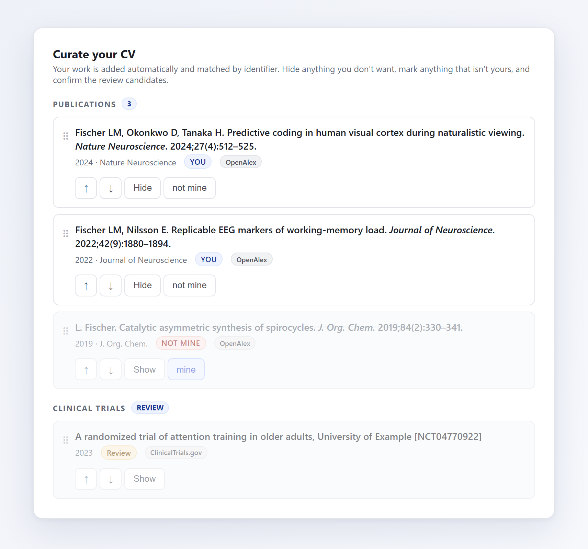
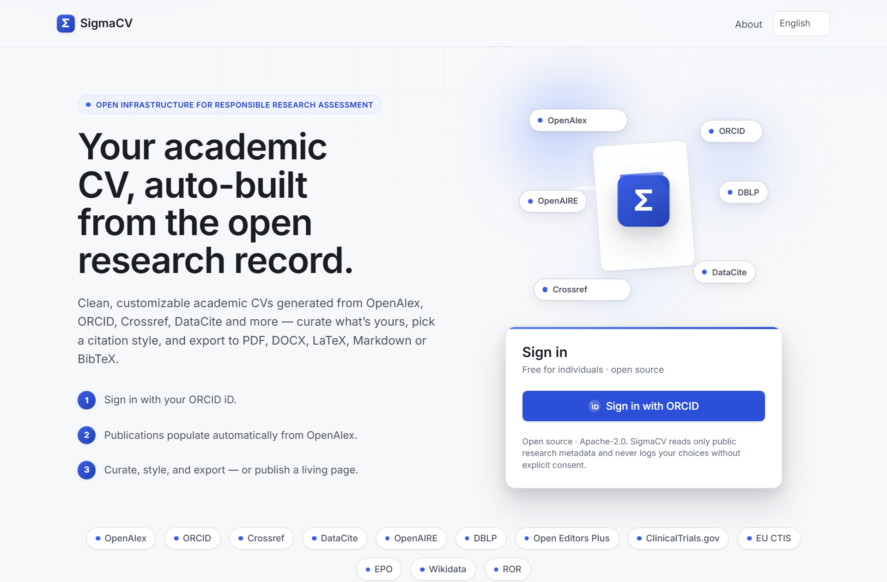

# SigmaCV

**A free, open-source tool that builds your academic CV for you — from the public research record.**

[](LICENSE)
[](https://sigmacv.org)
[](#available-in-10-languages)
[](https://sfdora.org/)
[](docs/OPEN-SCIENCE.md)
[](https://barcelona-declaration.org/)
[](CODE_OF_CONDUCT.md)
[](https://doi.org/10.5281/zenodo.20594123)
[](https://archive.softwareheritage.org/browse/origin/?origin_url=https://github.com/BasileChretien/sigmacv)
[](https://www.bestpractices.dev/projects/13146)
[](https://scorecard.dev/viewer/?uri=github.com/BasileChretien/sigmacv)
[](CITATION.cff)
[](https://scicrunch.org/resolver/RRID:SCR_028552)

[](https://www.producthunt.com/posts/sigmacv)

Keeping an academic CV up to date is a chore. Every new paper, grant, talk, or
editorial role means another manual edit — formatting citations by hand,
hunting down details, and redoing the whole thing in a different layout every
time a funder or employer asks for one.

**SigmaCV does that work for you.** You sign in, and it assembles a clean,
ready-to-use CV from open research databases — your publications and, where
available, your positions, education, funding, and more. You tidy it up, pick a
style, and download it as a PDF (or Word, LaTeX, and other formats), or publish
it as a web page that keeps itself current.

No copy-pasting your publication list. No spreadsheet of citations. No coding
required to use it.

> **In one line:** sign in → your CV fills itself in from public data → remove
> what isn't yours and pick a style → download it or publish it.

<p align="center">
  
</p>
<p align="center"><sub><em>An example CV — auto-built, with your own name highlighted in author lists. (Illustrative content.)</em></sub></p>

---

## Who it's for

Anyone with an academic publication record who needs a CV — and the people who
help them build one:

- **Researchers and academics** at any career stage, from PhD students and
  postdocs to senior faculty.
- **Clinicians and clinician-scientists** juggling papers, trials, and teaching.
- **Librarians and research-office / research-administration staff** who help
  others maintain their records.
- **Anyone simply curious** about their own scholarly footprint.

You do **not** need any technical skills to use SigmaCV. You sign in and click.
You sign in with your **ORCID iD** — a free, unique identifier for researchers
(think of it as a permanent digital name tag that stays with you across jobs,
name changes, and journals, from [orcid.org](https://orcid.org)). It's also what
lets SigmaCV find _your_ work reliably. _(Self-hosters can optionally enable
**Google** and **email magic-link** sign-in as well — see below.)_

## What you get

- **A CV that builds itself.** Your publications — and, where the data exists,
  your positions, education, funding, peer-review and editorial roles — are
  pulled automatically from open databases. You start from a filled-in CV, not a
  blank page.
- **The _right_ you.** Your work is matched by your researcher **identifier**
  (your ORCID iD / OpenAlex author ID), **never** by your name as text. That
  avoids the classic "someone else with my name" mix-up that plagues name-based
  tools — a real headache for common names and for names in non-Latin scripts.
- **You stay in control.** Anything that isn't yours, you mark **"not mine"** and
  it disappears from your CV (hidden, never silently deleted). You reorder items
  and choose which sections show. Nothing is invented; you decide what appears.
- **One CV, every format.** Because every output is built from the same
  underlying record, your citations look identical and correct everywhere.
  Download as **PDF, Word (DOCX), LaTeX, Markdown, BibTeX, CSL-JSON, JSON Résumé,
  or an NIH biosketch.**
- **58 one-click layouts.** Apply (and undo) ready-made CV templates for major
  funders, institutions, and industry in a single click — including UKRI R4RI,
  the Royal Society, the Swiss SNSF, the US NIH and NSF, the European ERC, and an
  ICH-GCP clinical-investigator CV. Applying a layout just selects, reorders, and
  re-titles sections — it never deletes your data.
- **A living public page.** Optionally publish your CV as a web page that
  re-syncs from the open record on its own, so it stays current without you
  touching it. It's machine-readable too: each publication carries embedded
  metadata, so a visitor can save your whole publication list straight into
  **Zotero, Mendeley,** or any other reference manager with their browser
  connector — and the page is available as BibTeX / CSL-JSON / JSON-LD.
- **Responsible metrics, or none at all.** Metrics are **off by default** and
  fully opt-in. When you do turn them on, SigmaCV prefers _field-normalized_
  indicators (which account for how citation rates differ between fields) over
  raw counts, and it **never** shows a journal's Impact Factor — in line with
  [DORA](https://sfdora.org/), the San Francisco Declaration on Research
  Assessment.
- **Available in 10 languages** (see [below](#available-in-10-languages)).

<p align="center">
  
</p>
<p align="center"><sub><em>You stay in control: keep, hide, mark "not mine", and confirm review candidates. (Illustrative.)</em></sub></p>

## How it works, in five steps

1. **Sign in** — with your **ORCID iD** (free, and it takes a minute to create
   at [orcid.org](https://orcid.org); it's also how SigmaCV finds your work).
2. **Your CV appears** — SigmaCV looks you up across open sources and assembles
   your publications and academic history automatically. No copy-paste.
3. **Curate** — remove anything that isn't yours, reorder entries, and choose
   which sections to show. You're always in charge.
4. **Style** — pick a citation style, highlight your own name in author lists,
   optionally switch on metrics, and choose a template or layout.
5. **Export or publish** — download in the format you need, or publish a living
   web page that keeps itself up to date. Missing a paper? Add it by its **DOI**
   (the short permanent identifier, like `10.1000/xyz`, printed on most articles).

<p align="center">
  
</p>
<p align="center"><sub><em>The SigmaCV homepage — sign in and your CV builds itself from the open record.</em></sub></p>

## Features at a glance

| Feature                       | What it means for you                                                                                                                                             |
| ----------------------------- | ----------------------------------------------------------------------------------------------------------------------------------------------------------------- |
| **Auto-populated CV**         | Starts from your real, public record — not a blank form.                                                                                                          |
| **Identifier-based matching** | Finds _your_ work by ORCID / OpenAlex ID, not by name — far fewer wrong-person mix-ups.                                                                           |
| **"Not mine" curation**       | Hide anything incorrect (it's hidden, not deleted); reorder and choose sections.                                                                                  |
| **Export formats**            | PDF, Word (DOCX), LaTeX, Markdown, BibTeX, CSL-JSON, JSON Résumé, and an NIH biosketch.                                                                           |
| **58 CV layouts**             | One-click funder / institution / industry templates — e.g. UKRI R4RI, Royal Society, SNSF, NIH, NSF, ERC, an ICH-GCP clinical-investigator CV.                    |
| **Living public page**        | Optionally publish a web page that re-syncs from the open record; machine-readable (BibTeX / CSL-JSON / JSON-LD) and one-click importable into Zotero / Mendeley. |
| **Consistent citations**      | One citation engine means identical, correctly formatted references in _every_ output.                                                                            |
| **10 languages**              | English, 中文, Español, Français, Deutsch, 日本語, Português, Italiano, 한국어, Русский.                                                                          |
| **Responsible metrics**       | Off by default and opt-in; prefers field-normalized indicators; never shows a journal Impact Factor.                                                              |

## ✅ Status: live

SigmaCV is **live at [sigmacv.org](https://sigmacv.org)** — sign in with your
ORCID iD and your CV is auto-built from the open record. It's free for
individuals and open source. (The name "SigmaCV" is a working title, tied to the
Sigma-Score bibliometric index, and may change.)

What this means for you:

- **If you're a researcher:** go to **[sigmacv.org](https://sigmacv.org)**, sign
  in with ORCID, and build your CV — nothing to install. Star or watch this
  repository to follow development.
- **If you're technical** (or you have an IT team): you can also **run your own
  copy** — see [For developers & self-hosting](#for-developers--self-hosting).

## Where your CV comes from

SigmaCV reads only **public** research metadata — the kind of catalogue
information that is already openly available. It never reaches into private
documents or full text, and it never changes anything in those databases on your
behalf. It draws on **12 open sources**:

| Source                                              | What it adds to your CV                                                                                    |
| --------------------------------------------------- | ---------------------------------------------------------------------------------------------------------- |
| [OpenAlex](https://openalex.org)                    | Your publications and citation metrics                                                                     |
| [ORCID](https://orcid.org)                          | Your verified identity, plus positions, education, funding, peer-review and service from your ORCID record |
| [Crossref](https://www.crossref.org)                | Fills gaps in publication details, and grants                                                              |
| [DataCite](https://datacite.org)                    | Your datasets and software                                                                                 |
| [OpenAIRE](https://www.openaire.eu)                 | Additional datasets and software                                                                           |
| [DBLP](https://dblp.org)                            | Your computer-science conference papers                                                                    |
| [Open Editors Plus](https://openeditors-plus.org)   | Journal editorial roles (editor / editorial-board memberships)                                             |
| [ClinicalTrials.gov](https://clinicaltrials.gov)    | Clinical trials where you're listed as an investigator                                                     |
| [EU CTIS](https://euclinicaltrials.eu)              | Clinical trials from the EU's public portal                                                                |
| [EPO](https://www.epo.org) (European Patent Office) | Your patents _(see note below)_                                                                            |
| [Wikidata](https://www.wikidata.org)                | Links to your scholarly identity on your public page                                                       |
| [ROR](https://ror.org)                              | Tidies up institution names so the same place isn't listed twice                                           |

**How matching keeps you safe from mix-ups.** Publications and items anchored to
your ORCID record carry a stable identifier, so they're matched by your **ORCID
iD / OpenAlex author ID** and included automatically — that's the reliable part.
Sources that carry _no_ identifier — clinical trials, patents, and some funder
grant lookups — are matched by your **name and organization** instead, so
SigmaCV presents these as **review candidates that you confirm** rather than
adding them silently.

> **Note on patents:** patents come from the European Patent Office and are
> matched by inventor name. This source only switches on if whoever runs the app
> provides a free EPO "Open Patent Services" credential. Without it, the patent
> feature simply stays dormant and adds nothing (no error).

## Your data, your rules

Trust matters when a tool touches your professional record. SigmaCV is built
privacy-first, as open infrastructure for responsible research assessment:

- **Reads only public research metadata.** It never accesses private or
  full-text content, and it never writes anything back to ORCID or OpenAlex.
- **Nothing is published without your say-so.** Public pages require per-field
  consent and are not search-engine-indexable until you opt in.
- **Your data stays yours.** Full data export and one-click account deletion, any
  time.
- **Built for GDPR and Japan's APPI** (the EU and Japanese data-protection laws).
- **No research logging without consent.** SigmaCV can support open-science
  research, but any logging of your choices is **off by default** and gated
  behind ethics-board (IRB) approval. Your curation is never recorded for
  research without your explicit consent.

The codebase has been through **three independent security reviews** with all
findings addressed. The full security posture — and the hardening that whoever
deploys it must configure — is documented in [`SECURITY.md`](SECURITY.md).

## Available in 10 languages

The interface is available in:

**English · 中文 · Español · Français · Deutsch · 日本語 · Português · Italiano · 한국어 · Русский**

## Why SigmaCV exists

Beyond being a handy free tool, SigmaCV is **open infrastructure for responsible
research assessment**, run not-for-profit. It deliberately resists the bad habits
of research evaluation: metrics are off by default, field-normalized indicators
are preferred over raw counts, and a journal's Impact Factor is never shown.

It is also a **research vehicle**: with explicit consent and under ethics-board
oversight, the project can support open-science research. None of that happens
without your consent and approved ethics review.

SigmaCV was created by **Basile Chrétien** (PharmD, MSc, MPH) of Nagoya
University.

---

## For developers & self-hosting

> Everything below is for people who want to run, host, or contribute to
> SigmaCV. If you just want to use it, the sections above are all you need.

SigmaCV is fully open source under **[Apache-2.0](LICENSE)** and **fully
self-hostable today** — there's no lock-in to any hosted instance. The
repository lives at
**[github.com/BasileChretien/sigmacv](https://github.com/BasileChretien/sigmacv)**.

### How it's built

|                        |                                                                                           |
| ---------------------- | ----------------------------------------------------------------------------------------- |
| **Framework**          | Next.js 15 (App Router) + TypeScript                                                      |
| **Database**           | PostgreSQL + Prisma                                                                       |
| **Auth**               | Auth.js v5 — ORCID iD (Google + email magic-link optional, off by default)                |
| **Citations**          | `citeproc-js` — the Citation Style Language (CSL) engine that also powers Zotero/Mendeley |
| **PDF rendering**      | Playwright (HTML → PDF, headless Chromium)                                                |
| **Validation / tests** | Zod · Vitest (1,000+ unit & integration tests)                                            |
| **Deploy**             | Docker Compose (app + Postgres + Caddy + render worker) on a single VPS                   |

### Architecture (load-bearing — please read before contributing)

- **One canonical CV object** (`src/lib/canonical/schema.ts`) — a single
  Zod-validated JSON document holds the curated data _and_ the display choices.
  It is the single source of truth.
- **Every output is a pure function of it** (`src/lib/render/`). There are no
  per-format pipelines: PDF, DOCX, LaTeX, Markdown, BibTeX, CSL-JSON, JSON Résumé
  and the NIH biosketch all derive from that one object through a single
  `Renderer` interface. (PDF is just the HTML renderer printed with a headless
  browser.)
- **Citations come only from `citeproc-js`,** so every format renders identical,
  correctly-styled references.
- **Self-name highlighting is identifier-driven, never name-based** — matched by
  ORCID / OpenAlex author ID, so it works for common names and non-Latin scripts.

Define and respect the canonical schema and the renderer interface before
changing anything downstream — everything depends on them.

### Run it locally

```bash
cp .env.example .env               # then fill in the values
npm install                        # also runs `prisma generate`
npm run fetch-csl                  # vendor CSL styles + en-US locale
npx prisma migrate dev             # create the schema in your database
npx playwright install chromium    # only needed for PDF export
npm run dev                        # http://localhost:3000
```

**Prerequisites:** Node.js ≥ 20, a PostgreSQL database (run one with
`docker compose up -d postgres`, or use any local/managed Postgres), and an
ORCID API client (the ORCID sandbox is free).

To register an ORCID **sandbox** client: create an account at
<https://sandbox.orcid.org>, go to **Developer Tools**, register an app, set the
redirect URI to `http://localhost:3000/api/auth/callback/orcid`, and copy the
Client ID / Secret into `.env` (keep `ORCID_ENVIRONMENT=sandbox`).

> Sandbox ORCID iDs have no OpenAlex records, so you'll see no real publications
> in the sandbox. Use `ORCID_ENVIRONMENT=production` with a production ORCID
> client to pull live data.

**Optional extra sign-ins.** ORCID is always available and is the primary login.
You can additionally enable **Google** (set `GOOGLE_CLIENT_ID` +
`GOOGLE_CLIENT_SECRET`) and an **email magic link** (set `EMAIL_SERVER` to an
SMTP URL + `EMAIL_FROM`). Each stays hidden until its credentials are present, so
the default deployment is ORCID-only — no dead buttons.

### Common commands

| Command                       | What it does                                        |
| ----------------------------- | --------------------------------------------------- |
| `npm run dev`                 | Start the dev server (auto-syncs the DB schema)     |
| `npm run build` / `npm start` | Production build / serve                            |
| `npm run typecheck`           | `tsc --noEmit`                                      |
| `npm test`                    | Run the Vitest unit/integration suite               |
| `npm run coverage`            | Run tests **and enforce the coverage gate**         |
| `npm run fetch-csl`           | Vendor CSL styles + locale into the citeproc assets |
| `npm run db:migrate`          | `prisma migrate dev`                                |
| `npm run e2e`                 | Playwright end-to-end journeys (needs a test DB)    |

### Self-host the full stack

```bash
cp .env.example .env               # set AUTH_URL, your domain, and secrets
docker compose up --build -d
```

Caddy terminates TLS and proxies to the app, which applies database migrations
on startup and renders PDFs in-process. The full runbook is in
**[`DEPLOY.md`](DEPLOY.md)**, and the production go-live checklist — secrets, a
production ORCID app, rate limiting, and the security hardening that **must** be
configured before exposing it publicly — is in
[`SECURITY.md`](SECURITY.md) and [`CLAUDE.md`](CLAUDE.md).

> **A note on `CLAUDE.md`:** that file (and the `CLAUDE.md` files in subfolders)
> are guidance for AI coding assistants and contributors — internal engineering
> and operations notes, not user documentation. Start with **this README** to use
> SigmaCV.

### Contributing

Contributions are very welcome — bug reports, new templates, and especially
**translating the interface.** The internationalization records require a value
in all 10 locales, so the build itself catches a missing translation. Start with
a [`good first issue`](https://github.com/BasileChretien/sigmacv/issues?q=is%3Aissue+is%3Aopen+label%3A%22good+first+issue%22),
and please read **[`CONTRIBUTING.md`](CONTRIBUTING.md)** and
**[`CODE_OF_CONDUCT.md`](CODE_OF_CONDUCT.md)** (Contributor Covenant 2.1) first.

> 🤝 **Looking for a co-maintainer.** SigmaCV is run by a single maintainer; if
> open research infrastructure is your thing, see
> [CONTRIBUTING.md](CONTRIBUTING.md#looking-for-a-co-maintainer).

## Open science & FAIR

SigmaCV is built to the
[FAIR principles](https://www.go-fair.org/fair-principles/) — for both the CVs it
produces and the software itself. The full statement is in
[`docs/OPEN-SCIENCE.md`](docs/OPEN-SCIENCE.md), with a sequenced roadmap in
[`docs/OPEN-SCIENCE-ROADMAP.md`](docs/OPEN-SCIENCE-ROADMAP.md), and the outreach
kit under [`docs/`](docs/). Highlights:

- **Identifier-driven, never name-based** matching, so records resolve
  unambiguously.
- **Provenance on every record** — source, match basis, and sync timestamps.
- **Privacy by default** — per-field publish consent; export and deletion
  (GDPR / APPI); public pages non-indexable until opted in.
- **Opt-in, field-normalized metrics** (default none), consistent with
  [DORA](https://sfdora.org/).
- **No lock-in** — self-hostable end to end.

## Questions or help?

- **A question, or your CV looks wrong?** Open a [Feedback or question](https://github.com/BasileChretien/sigmacv/issues/new?template=feedback.yml) issue — no technical knowledge needed.
- **Browse the [FAQ](docs/FAQ.md)** ("What is ORCID?", "Is it free?", "Where does my data come from?").
- **Chat with us** in [Discussions](https://github.com/BasileChretien/sigmacv/discussions).
- More options — and how to report a security issue privately — are in [`SUPPORT.md`](SUPPORT.md).

## Citing SigmaCV

If you use SigmaCV in your work, please cite it using the metadata in
[`CITATION.cff`](CITATION.cff) — GitHub's "Cite this repository" button renders
it automatically. Machine-readable software metadata is also provided in
[`codemeta.json`](codemeta.json), and archival deposit is configured via
[`.zenodo.json`](.zenodo.json).

SigmaCV is archived on **Zenodo** with a citable DOI. In papers, cite the
**concept DOI** — [10.5281/zenodo.20594123](https://doi.org/10.5281/zenodo.20594123) —
which always resolves to the latest version (the v0.1.0 release itself is
[10.5281/zenodo.20594124](https://doi.org/10.5281/zenodo.20594124)).

> Chrétien, B. (2026). _SigmaCV_ (v0.1.0). Zenodo. https://doi.org/10.5281/zenodo.20594123

To refer to the tool itself unambiguously, SigmaCV is registered in the
[SciCrunch](https://scicrunch.org/) resource registry as
**[RRID:SCR_028552](https://scicrunch.org/resolver/RRID:SCR_028552)**.

## License

[Apache-2.0](LICENSE). Bundled CSL citation styles are CC BY-SA 3.0 — see
[`NOTICE`](NOTICE).

---

_SigmaCV is a working name (it ties to the Sigma-Score bibliometric index) and
may change. Built not-for-profit by
[Basile Chrétien](https://orcid.org/0000-0002-7483-2489) (PharmD, MSc, MPH),
Nagoya University._
